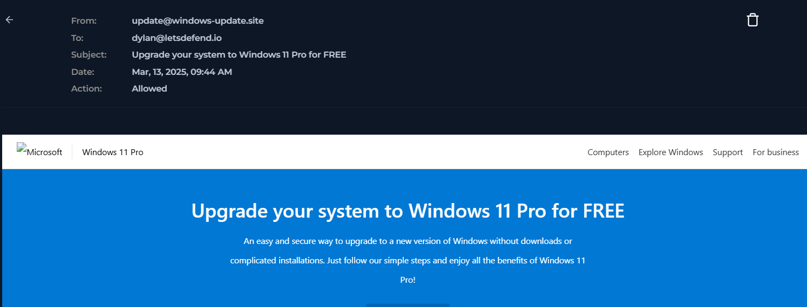
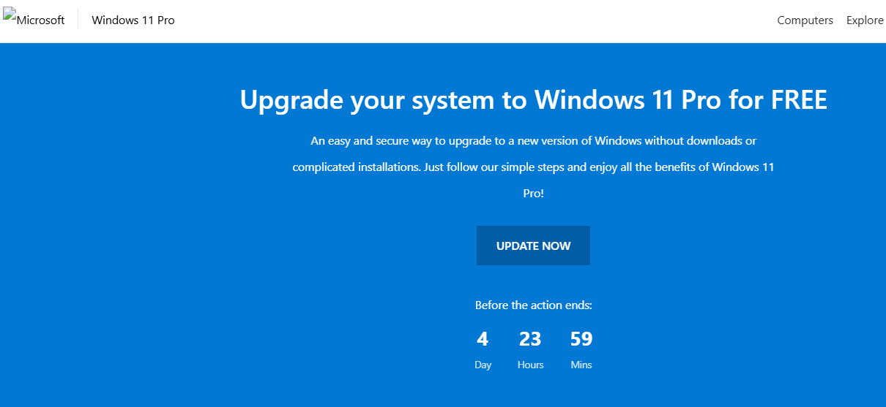
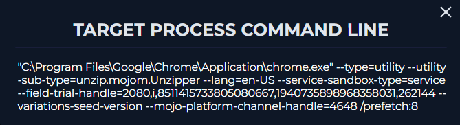
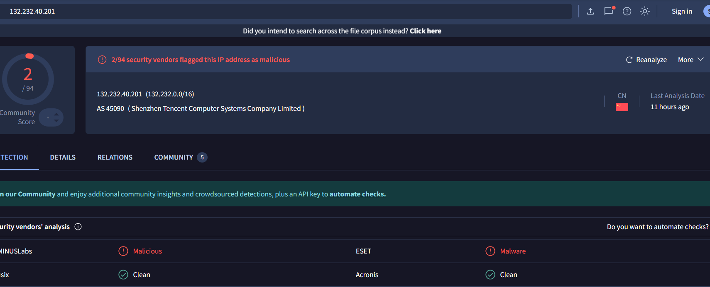
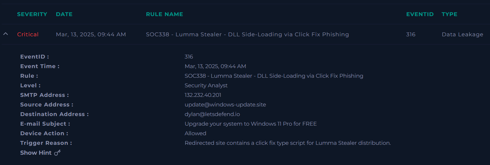
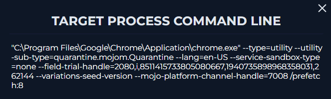
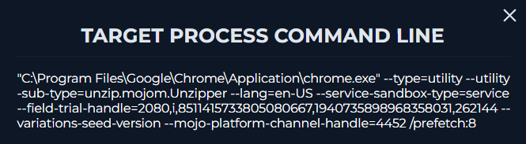
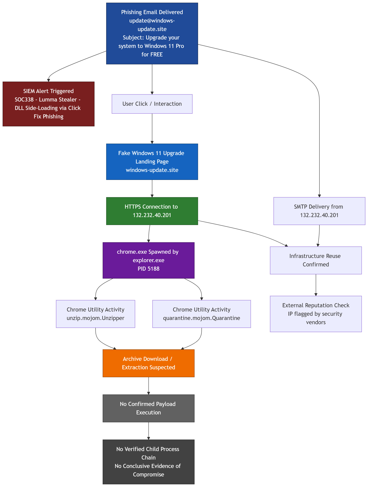

[]()

# Lumma Stealer ClickFix Phishing Analysis

## Overview

This project documents the investigation of a phishing campaign associated with **Lumma Stealer**, delivered through a fake **Windows 11 upgrade** lure.

The attack chain shows how a user was exposed to a phishing email, redirected to a malicious landing page, and triggered suspicious browser archive handling activity. While no payload execution was confirmed, the case demonstrates strong evidence of:

- phishing delivery
- user interaction
- malicious infrastructure access
- suspicious archive download and extraction behavior

---

## Investigation Scope

This analysis is based on correlated evidence from:

- SIEM alert telemetry
- phishing email content
- malicious landing page screenshots
- proxy/network logs
- browser process telemetry
- Chrome utility command-line activity
- IP reputation analysis

---

## Key Findings

- A phishing email impersonating Microsoft was delivered to the victim.
- The email used the sender address `update@windows-update.site`.
- The subject line was: `Upgrade your system to Windows 11 Pro for FREE`.
- The phishing infrastructure was linked to `132.232.40.201`.
- The user later connected to the same IP over HTTPS.
- Endpoint telemetry showed `chrome.exe` launched by `explorer.exe`, indicating user-driven execution.
- Chrome spawned archive-related utility activity involving:
  - `unzip.mojom.Unzipper`
  - `quarantine.mojom.Quarantine`
- This strongly suggests archive download and unpacking behavior.
- No malicious child process execution was observed after the browser activity.

---

## Attack Summary

The attack flow observed in this investigation:

1. Phishing email delivered to the user
2. User interacted with the phishing lure
3. Browser connected to attacker-controlled infrastructure
4. Fake Windows 11 update page loaded
5. Suspicious archive handling activity occurred in Chrome
6. No confirmed payload execution observed

---

## Evidence

### 1. SIEM Detection

The investigation started with a critical SIEM alert identifying a **Lumma Stealer ClickFix phishing** pattern.



The alert included:

- Rule: `SOC338 - Lumma Stealer - DLL Side-Loading via Click Fix Phishing`
- Source: `update@windows-update.site`
- Subject: `Upgrade your system to Windows 11 Pro for FREE`
- SMTP IP: `132.232.40.201`

---

### 2. Phishing Email

The phishing email impersonated a Microsoft/Windows update notification.



This message used social engineering themes such as urgency, free upgrade language, and Microsoft branding imitation.

---

### 3. Malicious Landing Page

After the user interaction, the victim reached a fake Windows 11 upgrade page.



Observed characteristics:

- fake Microsoft visual branding
- “UPDATE NOW” call-to-action
- countdown timer creating pressure and urgency

---

### 4. Network Correlation

Network telemetry confirmed that the victim host connected to the same IP that previously delivered the phishing email.



Important correlation:

- phishing email SMTP IP: `132.232.40.201`
- later HTTPS destination IP: `132.232.40.201`

This shows reuse of the same infrastructure for both delivery and user interaction.

---

### 5. IP Reputation

The IP used in this attack showed malicious reputation in external analysis.



Observed details:

- IP: `132.232.40.201`
- Some security vendors flagged the IP as malicious
- ASN referenced: Tencent cloud infrastructure

This does not prove compromise by itself, but it strengthens the malicious context.

---

### 6. Endpoint Browser Activity

Endpoint telemetry showed suspicious browser activity shortly after the user interaction.



Observed details:

- Process: `chrome.exe`
- Parent: `explorer.exe`
- PID: `5188`

This indicates a user-initiated browser session rather than a background service process.

---

### 7. Archive Handling Activity

Chrome spawned utility activity consistent with archive processing.



Observed command-line artifacts included:

- `--utility-sub-type=unzip.mojom.Unzipper`
- `--utility-sub-type=quarantine.mojom.Quarantine`

The pattern strongly suggests:

- compressed archive download
- archive extraction
- quarantine or browser safety handling

This is consistent with a suspicious delivery stage.

---

## Timeline

| Time | Event |
|------|-------|
| Mar 13, 2025 09:44 AM | Phishing email delivered |
| Mar 13, 2025 09:44 AM | SIEM alert triggered |
| Mar 13, 2025 11:26 PM | Internal host connected to `132.232.40.201` over HTTPS |
| Mar 13, 2025 11:26:08 PM | `chrome.exe` activity observed |
| Mar 13, 2025 11:26:08 PM | Archive-related Chrome utility processes observed |

---

## MITRE ATT&CK Mapping

| Tactic | Technique | ID |
|--------|-----------|----|
| Initial Access | Phishing | T1566 |
| Execution | User Execution | T1204 |
| Defense Evasion | Masquerading | T1036 |
| Command and Control | Application Layer Protocol: Web Protocols | T1071.001 |
| Command and Control / Delivery | Ingress Tool Transfer | T1105 |

---

## Technical Assessment

This investigation confirms:

- successful phishing delivery
- confirmed user interaction with attacker infrastructure
- suspicious archive download or unpacking behavior

However, no evidence was identified for:

- PowerShell execution
- command shell activity
- secondary payload launch
- suspicious post-download child process creation
- confirmed persistence
- confirmed data exfiltration

### Final Assessment

This case appears to represent a **phishing-driven malware delivery attempt** that progressed through the **delivery and archive-handling stage**, but **payload execution was not confirmed** based on the available evidence.

---

## Indicators of Compromise

| Type | Value |
|------|-------|
| Domain | `windows-update.site` |
| IP | `132.232.40.201` |
| Email Sender | `update@windows-update.site` |
| Email Subject | `Upgrade your system to Windows 11 Pro for FREE` |
| Malware Family | Lumma Stealer |

---

## Lessons Learned

This case highlights the importance of correlating evidence across:

- email security telemetry
- proxy/network connections
- endpoint process activity
- browser utility behavior
- external infrastructure reputation

Even when full malware execution is not observed, early-stage evidence can be enough to identify and contain a malicious campaign before full compromise occurs.

---

## Diagram



---

## Repository Structure

```text
.
├── README.md
├── IOC.md
├── MITRE.md
├── TIMELINE.md
└── screenshots/


